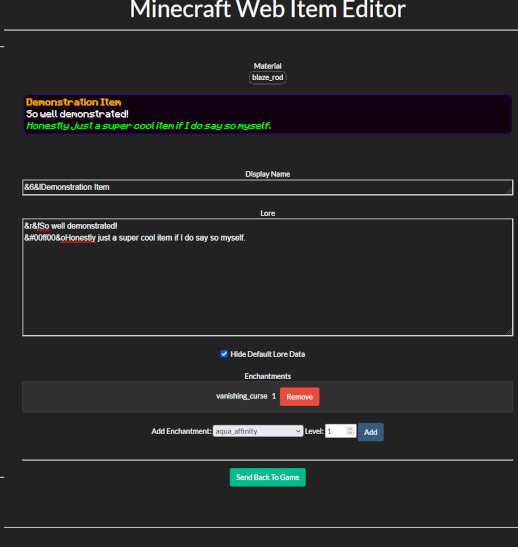

WebItemEditor
-------------

A web-page item editor for Minecraft using Denizen.

Note that this does not edit every detail of an item. Just the display name, lore, enchantments, and the data hides toggle.

### Installation

- Add `scripts/web_item_helper.dsc` into your scripts folder.
- If you don't already have a Denizen webserver:
    - Add `scripts/webserver.dsc` and configure it.
    - Copy the files under `webroot/`. Consider editing the `index.htm` file and replacing the `favicon.ico`
    - If you intend to make this tool accessible outside of localhost, configure a reverse proxy like Nginx or Apache.
- If you do already have a Denizen webserver:
    - just copy out the `data` script named `webtools_config` from `webserver.dsc` and configure that.
    - Copy over the webroot contents, excluding `favicon.ico` and `index.htm`

### Usage

- Give permission `dscript.webedititem` to those who should have access
- Just hold an item and do `/webedititem`
- Click the link it gives you
- Edit item details on the page however you wish (do not leave the minecraft server while you're editing)
- Click `Send Back To Game`
- It will open an inventory in-game, which you can pull the item from

### Licenses

- Made using the [Minecraft Regular font from OnlineWebFonts.com](https://www.onlinewebfonts.com/download/6ab539c6fc2b21ff0b149b3d06d7f97c), licensed as CC-BY 3.0
- Made using the [Darkly Bootstrap Theme](https://bootswatch.com/darkly/) by Thomas Park, which was released under the [MIT License](https://github.com/thomaspark/bootswatch/blob/7fcf822114e71cfb3b89e98afb58055d21f5e240/LICENSE).
- All other content is the work of Alex 'mcmonkey' Goodwin, [licensed under the same license as the rest of this repo](https://github.com/mcmonkeyprojects/DenizenSampleScripts/blob/master/LICENSE.txt).
